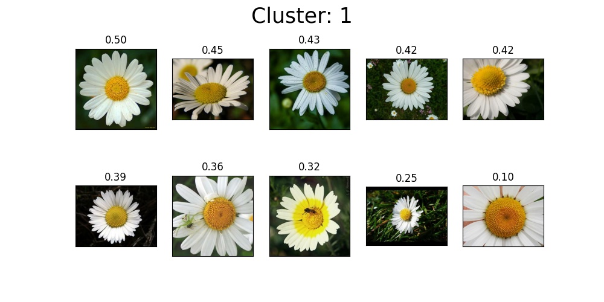
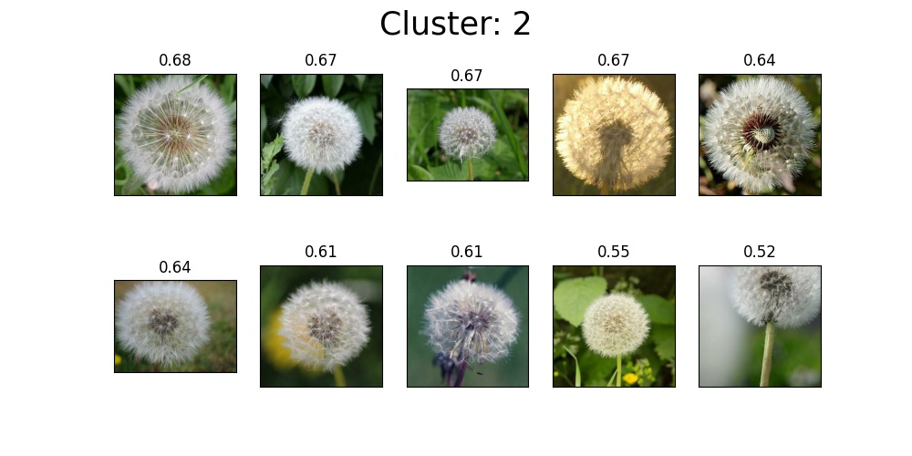
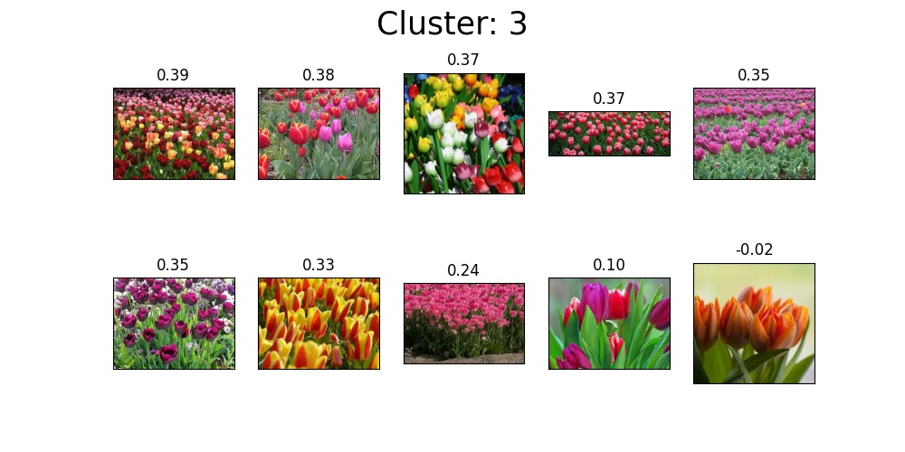
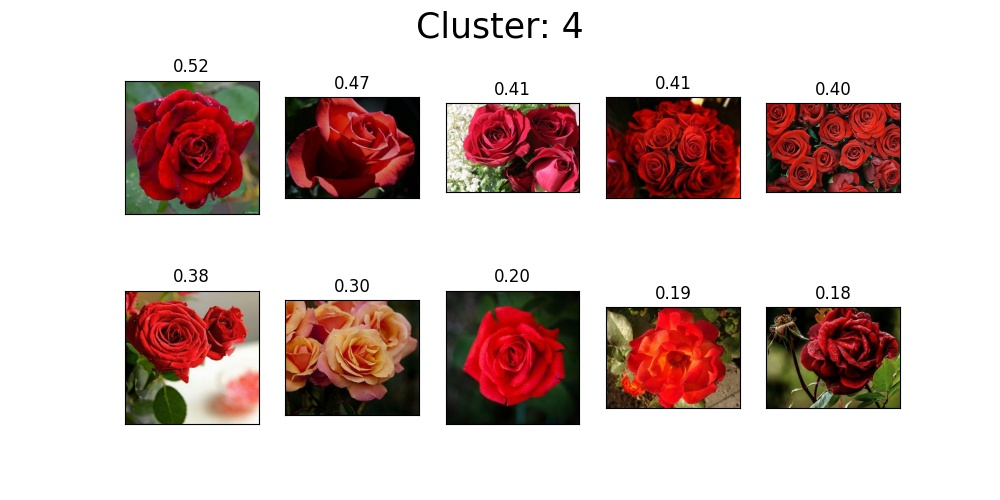
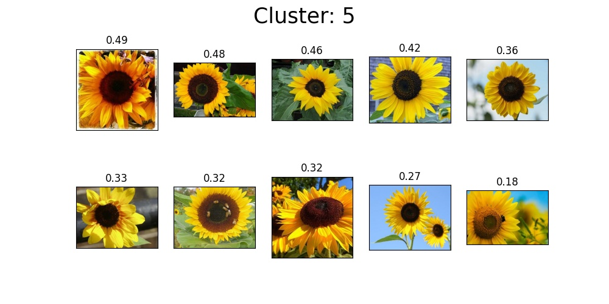

# K-medoids Clustering

The K-means clustering algorithm is sensitive to outliers, because a mean is 
easily influenced by extreme values. K-medoids clustering is a variant of 
K-means that is more robust to noises and outliers. Instead of using the mean 
point as the center of a cluster, K-medoids uses an actual point in the cluster 
to represent it. Medoid is the most centrally located object of the cluster, 
with minimum sum of distances to other points.

## Classification results

## Comment on the results

From the above pictures, we can see that the algorithm correctly arranged the 
pictures into clusters. Algorithm arranged images into clusters based on 
medoids, which measure the distances between images or vectors by the distance 
based on cosine similarity. This algorithm divided the images into clusters 
according to their type, i.e. there are only flowers of the same species in 
each cluster. In the first cluster, there are daisies, in the second dandelion,
in the third roses, in the fourth sunflowers, and in the last, fifth, are tulips.

I think the results are very good, but that doesn't mean that our algorithm 
works perfectly on real-world problems. Opposite! We probably got such good 
results because of the selected pictures, which are very similar to each other 
within the species, and the species as a whole differ greatly from each other.
Similar results in the given images would likely be obtained with an algorithm 
that does not use a neural network. Due to the mentioned opinion, we tested our 
algorithm in other image domains, but where it was not cut off so well. For 
example, pictures of vehicles (car, bus, suv, and tractor) were grouped only 
partially correct, and in the pictures of food (hamburger, pizza, pasta, salad) 
the resulting lumps were completely wrong. 

To sum up, the algorithm does not always group images correctly according to 
content, which means that we can help classify the data into approximate, 
real-world problems with our algorithm clusters, but the accuracy of these 
clusters cannot be completely relied upon.

## Justification of the number of groups

The number of groups was determined based on a priori knowledge of the problem 
domain, since the images above which we made the findings, we chose ourselves. 
We chose exactly five different types of flowers, namely daisies (cluster 1), 
dandelion (cluster 2), roses (cluster 3), sunflowers (cluster 4), and tulips 
(cluster 5).

The algorithm divided the given images into **five** clusters with an average 
silhouette of **0.397**. To interesting findings, we came up with trying all the 
other numbers groups. For example, we obtained an average silhouette for three 
clusters 0.412, for four clusters 0.381, for six clusters 0.403 and for seven 
clusters 0.385.